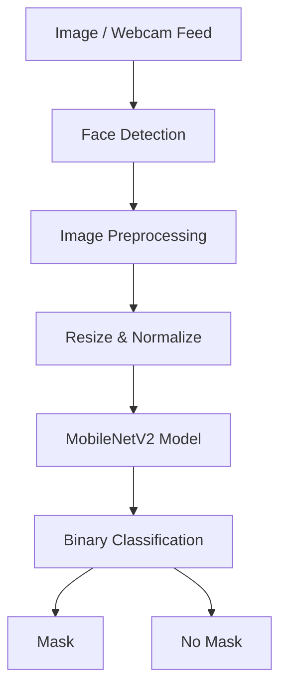
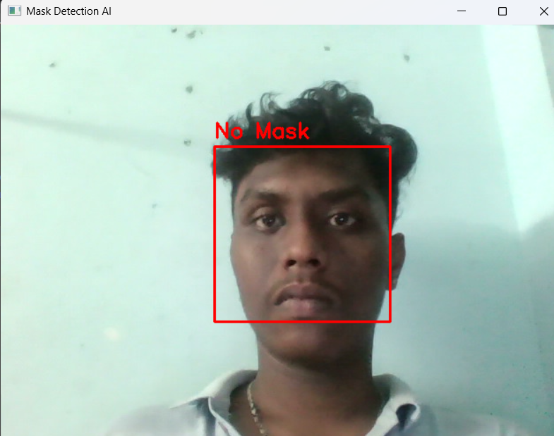

<div align="center">

# 😷 Face Mask Detection AI

### Real-Time Face Mask Detection using Deep Learning, TensorFlow, MobileNetV2 & OpenCV

<p>


</p>

### Building Intelligent Vision Systems with Deep Learning

A computer vision project that detects whether a person is wearing a face mask from static images and live webcam streams using transfer learning and real-time inference.

</div>

---

# 🎯 Problem Statement

During the COVID-19 pandemic, automated mask compliance systems became an important application of Artificial Intelligence and Computer Vision.

This project explores how deep learning models can be trained to classify facial images into:

* 😷 Mask
* ❌ No Mask

The system performs both image-based prediction and real-time webcam detection.

---

# 🚀 Project Highlights

✅ Real-Time Face Mask Detection

✅ Deep Learning-Based Classification

✅ Transfer Learning with MobileNetV2

✅ Live Webcam Inference

✅ Image-Based Prediction

✅ OpenCV Integration

✅ Dataset Processing & Training Pipeline

✅ End-to-End AI Project Development

---

# 🧠 Technologies Used

| Category             | Technologies      |
| -------------------- | ----------------- |
| Programming Language | Python            |
| Deep Learning        | TensorFlow, Keras |
| Computer Vision      | OpenCV            |
| Model Architecture   | MobileNetV2       |
| Data Processing      | NumPy             |
| Visualization        | Matplotlib        |
| Model Storage        | H5                |

---

# 🏗️ System Architecture



---

# 📂 Project Structure

```text
Face-Mask-Detection-AI
│
├── dataset/
│   ├── with_mask/
│   └── without_mask/
│
├── train.py
├── webcam.py
├── predict.py
│
├── mask_detector.h5
├── requirements.txt
├── README.md
└── .gitignore
```

---

# 📊 Dataset

The model was trained using a dataset containing thousands of labeled facial images.

### Classes

| Class        | Description                    |
| ------------ | ------------------------------ |
| With Mask    | Face wearing a protective mask |
| Without Mask | Face without a protective mask |

### Data Preparation

* Image Resizing
* Pixel Normalization
* Dataset Splitting
* Training / Validation Segregation
* Data Loading using TensorFlow Generators

---

# ⚙️ Model Development

## Base Architecture

MobileNetV2 was selected because:

* Lightweight architecture
* High inference speed
* Excellent performance on edge devices
* Strong transfer learning capabilities

## Training Strategy

* Transfer Learning
* Frozen Base Layers
* Custom Classification Head
* Binary Cross Entropy Loss
* Adam Optimizer

---

# 🔄 Training Pipeline

1. Dataset Collection
2. Data Cleaning
3. Image Preprocessing
4. Transfer Learning Setup
5. Model Training
6. Validation
7. Model Saving
8. Real-Time Deployment

---

# 📈 Results

| Metric                | Status                    |
| --------------------- | ------------------------- |
| Training Accuracy     | Evaluated During Training |
| Validation Accuracy   | Evaluated During Training |
| Binary Classification | Completed                 |
| Real-Time Inference   | Implemented               |
| Webcam Detection      | Implemented               |

---

# 📸 Demo

## Real-Time Webcam Detection

<p align="center">
  
</p>

---

# ⚠️ Challenges Faced

* Handling varying lighting conditions.
* Detecting faces at different angles.
* Maintaining real-time inference speed.
* Reducing false classifications during webcam detection.
* Optimizing preprocessing and model performance.

---

# 🔬 Key Learnings

Through this project I gained hands-on experience with:

* Deep Learning Fundamentals
* Transfer Learning
* TensorFlow & Keras
* OpenCV
* Real-Time Computer Vision Systems
* Dataset Preparation
* Model Training & Validation
* AI Project Deployment Workflows

---

# 🚀 Future Improvements

* Multi-face simultaneous detection.
* Face mask type classification.
* Edge-device deployment.
* Improved robustness under poor lighting.
* Mobile application integration.
* Real-time analytics dashboard.

---

# 👨‍💻 Author

### Sathvik Munaga

B.Tech Computer Science & Engineering (AI & ML)

SRM Institute of Science and Technology, Chennai

* GitHub: https://github.com/SathvikMunaga
* LinkedIn: https://www.linkedin.com/in/narasimha-sathvik-munaga-486880212/

---

### ⭐ If you found this project interesting, consider giving it a star.
