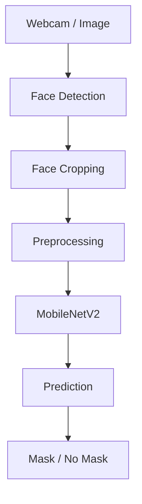

<div align="center">

# 😷 Face Mask Detection AI

### Real-Time Face Mask Detection using TensorFlow, MobileNetV2 & OpenCV


</div>

---

## 🚀 Overview

A real-time computer vision application that detects whether a person is wearing a face mask using a MobileNetV2-based deep learning model.

---

## ⚡ Features

<table>
<tr>
<td>📹 Real-Time Detection</td>
<td>🧠 MobileNetV2 Transfer Learning</td>
</tr>

<tr>
<td>🖼️ Image Prediction</td>
<td>⚡ Fast Inference</td>
</tr>

<tr>
<td>🎯 Face Detection</td>
<td>📊 Binary Classification</td>
</tr>
</table>

---

## 🏗️ Pipeline



## 📂 Project Structure

```text
MaskDetectionAI
│
├── dataset/
├── train.py
├── webcam.py
├── predict.py
├── mask_detector.h5
├── README.md
├── requirements.txt
└── .gitignore
```

## 📸 Demo

<p align="center">
  
</p>

## 🛠️ Run Project

```bash
pip install -r requirements.txt
python train.py
python webcam.py
```

## 👨‍💻 Author

### Sathvik Munaga

AI End Semester Project
